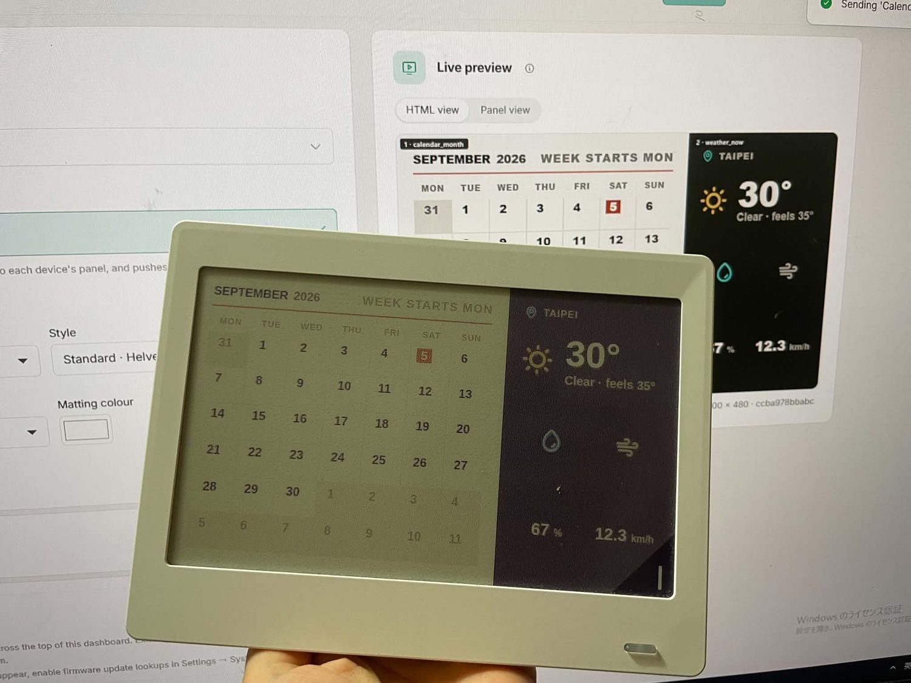

# ULANI-ESP32

  

相信有興趣進來看的人或多或少都會因為日曆有時候不更新，或是擔心到了新的一年後官方日曆主題就不再提供了。

當初 ULANI 設計的方向是，希望圖片由手機運算完成，再由手機把畫面傳送到裝置上。雖然對節省成本/增加開發速度很有幫助，但這樣的架構會有幾個問題:

1. 手機不在旁邊時，日曆就不會更新
2. 如果手機內的 app 並沒有常駐在後台，即使手機靠近日曆也不會更新
3. 如果手機剛好藍牙關了或是不穩定，沒有連上日曆，即使手機靠近日曆也不會更新

.

雖然很多情況下是 ULANI 團隊沒辦法控制的， 例如 app 的後台被手機清掉了

但種種情況疊加會讓體驗變得不太好(我的日曆也是因為這個原因吃灰了一段時間)

並且因為專案距離出貨後已經過了幾個年頭，能預期後續得到的維護也會越來越少

.

所以就有打算讓電子日曆脫離官方的 APP，從產生日曆圖片，到發送到 ULANI 電子日曆，全部都是在自己架設的服務中完成

因為 ULANI 電子日曆只支援藍芽，能夠讓 ULANI 擺脫手機，能夠自己連上網路，從網路上抓圖來顯示就是一件很重要的事情

也就是這個專案想做的事情

.

## 功能介紹

讓 [ULANI 電子日曆](https://www.ulani.com.tw/) 變成一台
[Tesserae](https://tesserae.ink/) 底下的裝置。

.

[Tesserae](https://tesserae.ink/) 是一個專門為電子相框社設計的服務，裡面可以編輯電子相框想要顯示的畫面

可以是一張日曆，天氣預報，行事曆，或是股票行情

Tesserae 可以在指定的時間把日曆要顯示的畫面先運算好，電子相框發現有新的圖片後，就畫抓下來並顯示出來

.

這會需要一片 ESP32 常駐在日曆旁邊，透過藍牙控制日曆。ESP32 是一塊能夠上網，有藍芽功能，可以執行簡單程式的開發版。

ESP32 定時去把 Tesserae 產生的日曆圖抓回來後更新到 ULANI 電子日曆上。

全程不需要官方 App，也不需要一台開著藍牙的電腦。ESP32 這塊小小的開發版就能勝任一切。

.

並且有這些功能:

- **四頁獨立**：使用之前 ULANI 官方設計能夠切換四個頁面的功能，讓每一頁可串接一個 Tesserae dashboard 畫面。
- **記住日曆**：每次 Esp-32 通電時都會找到上一次連線的日曆，不需要進後台重新設定。
- **省電**：平常不需要隨時和 ULANI 日曆保持連線，能夠更省電一些。
- **esp-32 C3 / S3 皆可**：原始碼不綁晶片。

  
   
  ULANI 日曆顯示 Tesserae 算好的畫面，背景是 Tesserae 網頁上的 live preview。

.

## 我是新手，看不懂這專案的程式，我只想讓我的日曆能動起來
參考 [**docs/getting-started.md**](docs/getting-started.md) —— 從架 Tesserae、燒韌體、
到第一張圖上牆的完整教學，會解釋中間每個角色是什麼。

然後你可能會需要買一片 **esp-32 開發版**

但不貴，200 元內

.

## 我想改這個專案
有這些文件可以參考:

- [docs/building.md](docs/building.md) — clone 之後怎麼編譯、燒錄、跑前端。
- [docs/architecture.md](docs/architecture.md) — 專案結構與分層。
- [docs/rest-api.md](docs/rest-api.md) — 韌體的 REST 端點。
- [docs/protocol.md](docs/protocol.md) — 逆推出來的 ULANI 藍牙協定。
- [docs/flashing.md](docs/flashing.md) — 用瀏覽器刷 release 韌體。
- [docs/releasing.md](docs/releasing.md) — 發 release 的版號規則。
- [docs/known-issues.md](docs/known-issues.md) — 已知限制。
- [docs/background.md](docs/background.md) — 為什麼有這個專案、為什麼這樣選型。
- [AGENTS.md](AGENTS.md) — 給 coding agent 的導覽。

.

## 致謝
專案能在短短時間內完成，脫離不了這些人/專案的協助:
- [**Grassboy/ULANI.node.js**](https://github.com/Grassboy/ULANI.node.js) —— 日曆的
藍牙協定完全來自這份逆向工程成果，本專案的協定層照它實作，沒有它就沒有這個專案。
- [**Tesserae**](https://github.com/dmellok/tesserae) —— 產生日曆畫面的服務，本專案的核心是 `把 ULANI 變成 Tesserae 這個服務的一個裝置`。
- [**Claude Code**](https://claude.com/claude-code) —— 大部分程式與文件由它協助完成。

