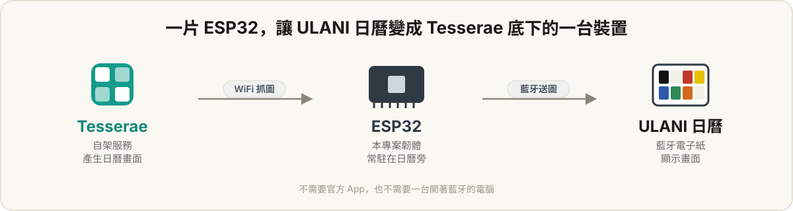

# 如何讓 ULANI 日曆脫離官方 app ，變成真正每天都會更新的 "永恆曆"

在 [readme](../readme.md) 中有簡單介紹過功能

這篇文章會詳細解釋，一個只有一台 ULANI 日曆 的新手，如何一步步完成設定

.

## 先認識這幾個角色
運作流程：**你在 Tesserae 上設計畫面 → Tesserae 算成圖 → ESP32 定時抓回來 → 藍牙送進日曆。**

<p align="center">
  
</p>


| 角色             | 是什麼                              | 在這裡的工作                                                                   |
| -------------- | -------------------------------- | ------------------------------------------------------------------------ |
| **ULANI 電子日曆** | 你手上那台 7.3 吋電子紙日曆                 | 顯示畫面。它只會被藍牙更新，一次只能被一台裝置連著。                                               |
| **ESP32**      | 一片很小、很便宜（約台幣一兩百元）的開發板，內建藍牙和 WiFi | 常駐在日曆旁邊。一邊用藍牙連日曆，一邊用 WiFi 連你家網路去跟 Tesserae 拿圖，再把圖送進日曆。**本專案的韌體就是燒在它上面。** |
| **Tesserae**   | 一套你自己架在電腦／NAS 上的服務               | 產生日曆畫面：要顯示什麼、長怎樣、多久更新，全部在它的網頁上設定。                                        |
| **你家 WiFi**    |                                  | 讓 ESP32 能夠上網，連接到 Tesserae 伺服器。                                           |


你需要準備：

- 一台 ULANI 日曆
- 一片 ESP32（ESP32-C3 或 S3，帶 USB）
- 一台能一直開著跑 Docker 的電腦或 NAS。如果只有電腦，也可以把服務放在電腦上，但電腦關機時日曆就不會更新了。

.

可能會需要:

- 懂一點 docker 或是跑指令的知識，知道如何把 Tesserae 服務跑起來
- 懂一點網路的設定，知道如何讓架起來 Tesserae 服務能夠讓外面連上
- 懂一點韌體相關的東西，知道如何燒錄別人寫好的韌體

.

如果不會，去找一個會的朋友

或是找一個會的 AI 服務來問

.

## 第一步：把 Tesserae 服務架起來
在能跑 Docker 的機器上：

```sh
mkdir tesserae && cd tesserae
curl -fsSLO https://raw.githubusercontent.com/dmellok/tesserae/main/docker-compose.yml
docker compose up -d
```

開瀏覽器進 `http://<那台機器的區網IP>:8765`，設定密碼、走完初始精靈。

之後就先擺著，第三步會回來拿「配對碼」。

> Tesserae 的細節看它自己的[說明](https://github.com/dmellok/tesserae)。

.

## 第二步：弄一片 ESP32 並燒進韌體
買一片 **ESP32-C3** 或 **ESP32-S3** 開發板（例如常見的 C3 SuperMini），用 USB 線接電腦。

.

不想裝開發環境的話，用桌機版 Chrome / Edge 從瀏覽器就能燒。剛買來的 **ESP32-S3** 開發板 裡面沒有任何功能，需要把韌體放進 **ESP32-S3** 內，讓開發版知道開機後該做什麼

到本專案的
[Releases](https://github.com/andy840119/ULANI-ESP32/releases) 抓對應晶片的
`ulani-esp32c3-merged.bin` 或 `ulani-esp32s3-merged.bin`，照
[**flashing.md**](flashing.md) 一步步做（含進入下載模式、選埠、燒錄位置）。

.

燒完板子會重開(或是按下上面的 reset 按鍵，或是重新插拔下)

打開手機的 Wifi ，可以搜尋到一個叫做 `ULANI-Setup-XXXX` 的熱點

.

## 第三步：進 ESP32 後台，進行設定
ESP32 開機後會開一個名為 `ULANI-Setup-XXXX` 的**開放熱點**（XXXX 是板子 MAC 末四碼，每一台裝置後面數字會不同）。

手機或電腦連上這個熱點，通常會自動跳出設定頁；沒跳就開瀏覽器輸入 [http://192.168.4.1/](http://192.168.4.1/`。這就是](http://192.168.4.1/`。這就是)) 。這就是 ESP32 的後台。

.

接下來有三個步驟要做:

1. **先讓 ULANI 日曆連上 ESP-32 開發版** ——在「日曆」分頁：
  - 確認日曆已開機、沒有被官方 App 或其他電腦連著。如果手機之前連接過，需要把藍芽裝置清掉。
  - 按「搜尋日曆」→ 選你的裝置 → 連線。
  - 連上後可以按「送測試圖」丟一張色塊圖確認整條藍牙通了。
  - **連不上、出現** `connect: ESP_FAIL`**？** 多半是日曆還記著舊配對（e.g. 曾配過官方 App）。照「日曆」分頁裡的說明，把日曆**回復出廠預設值**
  後再連。連上後配對會記在板子上，之後通電自動連回。
2. **讓 ESP-32 開發版 連接家裡 WiFi** —— 在「WiFi」分頁：搜尋、選你家網路、輸入密碼、連線。
  - 連上後畫面會顯示一個 `http://192.168.x.x/` 的網址，之後用電腦瀏覽器開那個網址
   就能直接進後台，不用再切到 ESP32 的熱點。
  - ESP-32 上面的熱點不會關，wifi 連接錯的話可以靠手機連回 ESP-32 的熱點重新設定。連上路由器的瞬間手機可能斷幾秒再自動連回，是正常的。
3. **接 Tesserae** —— 在「Tesserae」分頁：
  - 回到 Tesserae 網頁拿配對碼：**Settings → Devices → Add device → Transport 選
   REST API → 按「+ Issue pairing code」**。
  - 把 Tesserae **server 網址**（填**區網 IP**，例如 `http://192.168.1.10:8765`，不要填外網
  網域）和**配對碼**填進某一頁（第 1～4 頁各自獨立）。用配對碼時板子型號會被自動
  辨識，不用手動選。

> **為什麼 server 網址要填區網 IP？** Tesserae 預設只把圖片給區網內的用戶端；填外網
> 網域會註冊成功、但下載圖片時被回 403。配對碼是一次性的，失敗就回去再按一次拿新的。

## 第四步：做一張日曆畫面，並傳送到  ULANI 日曆 上

Step:
1. 在 Tesserae 網頁上，替剛剛那台裝置編輯它的 dashboard——放時鐘、行事曆、天氣。照片都在 Tesserae 上設定，**ESP32 不做任何影像處理**。
2. 設定它多久更新一次。時間到，Tesserae 算好新圖，ESP32 下次向它詢問時就會抓回來、動送進日曆。想馬上看效果，可以在 ESP32 後台的「Tesserae」分頁按「從 Tesserae新資料」再按「把圖片送到 ULANI」。
3. 送出去的圖右下角可以設定是否要顯示頁碼。因為可能會遇到日曆目前顯示在第三頁，但 Tesserae 的圖片傳送到第一頁的情況。有頁碼會比較容易辨識。

.

接好之後就不用管了：Tesserae 每天按排程算圖，ESP32 每天按排程抓圖和傳送圖片到日曆上，日曆會自己更新。
